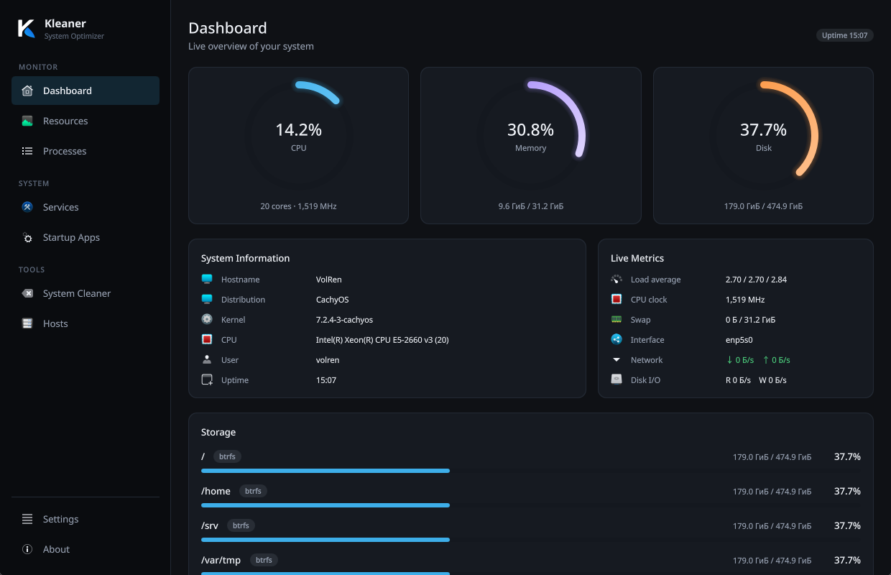

<p align="center">
  
</p>

# Kleaner

[](https://github.com/VolRencs/Kleaner/actions/workflows/build.yml)
[](LICENSE)
[](https://www.qt.io/)
[](https://kde.org/)

[Website](https://volrencs.github.io/Kleaner/) ·
[Releases](https://github.com/VolRencs/Kleaner/releases) ·
[Changelog](CHANGELOG.md) ·
[Report an issue](https://github.com/VolRencs/Kleaner/issues)

Kleaner is a Linux system optimizer and monitoring application with a modern
dark interface. It is a fork of [Stacer](https://github.com/QuentiumYT/Stacer)
rewritten around Qt 6, KDE Frameworks 6 and Wayland.

The project targets **Arch Linux** only.



## Features

- **Dashboard** — live CPU, memory and disk gauges, system information, storage
  usage and live metrics.
- **Resources** — rolling 60-second history charts for CPU usage (per core,
  with the total load in the header), load average, memory/swap, disk I/O and
  network throughput. History is only sampled while the charts are visible.
- **Processes** — sortable and filterable process list (CPU, memory, RSS,
  state, …) with terminate and force-kill actions. The list updates every two
  seconds without stealing your scroll position.
- **Services** — systemd units over D-Bus with start/stop/restart, enable and
  disable through polkit, and click-to-sort column headers.
- **Startup Apps** — XDG autostart entries, including system entries from
  `/etc/xdg/autostart` (user overrides are created on demand).
- **System Cleaner** — trash, application caches, temporary files (`/tmp`),
  system logs, the systemd journal (rotated and vacuumed completely), the pacman
  package cache, orphan packages and crash reports. Selections are remembered
  between sessions. Privileged cleanup runs through a KAuth helper with an
  allowlist.
- **Hosts** — view and edit `/etc/hosts` with a KAuth helper writing the file
  atomically.
- **Translations** — the interface is fully translated into Russian and
  Ukrainian; other locales fall back to English.

## Requirements

- Arch Linux with systemd
- Wayland session (Plasma or another compositor)
- A polkit authentication agent
- An icon theme (`breeze-icons` recommended)

## Installation

### Arch Linux package (PKGBUILD)

The packaging files live in `packaging/aur`: `kleaner` builds the tagged release,
`kleaner-git` tracks the `main` branch:

```bash
git clone https://github.com/VolRencs/Kleaner.git
cd Kleaner/packaging/aur/kleaner
makepkg -si
```

### Manual build

```bash
sudo pacman -S --needed \
  base-devel cmake ninja extra-cmake-modules \
  qt6-base qt6-declarative qt6-svg qt6-tools \
  kirigami kcoreaddons kconfig kdbusaddons \
  kstatusnotifieritem kio kauth breeze-icons

cmake -S . -B build -G Ninja -DCMAKE_BUILD_TYPE=Release -DCMAKE_INSTALL_PREFIX=/usr
cmake --build build
sudo cmake --install build
```

`sudo cmake --install` (or `makepkg -si`) is required for privileged operations:
it installs the KAuth helper and the polkit actions used by the system cleaner
and the hosts editor.

Run the application with `kleaner`, or start *Kleaner* from the application
menu.

## Configuration

Settings are stored in `~/.config/kleanerrc` (KConfig). The interface language
can be changed in *Settings → Language*; it defaults to the system locale.

Translations are installed to `/usr/share/org.volren.kleaner/translations` and
loaded according to the selected language.

## Development

```bash
cmake -S . -B build -G Ninja -DCMAKE_BUILD_TYPE=Debug
cmake --build build -j $(nproc)
ctest --test-dir build --output-on-failure
./build/bin/kleaner
```

Translation catalogs live in `translations/` (Russian and Ukrainian) and can be
refreshed with the CMake targets:

```bash
cmake --build build --target update_translations
cmake --build build --target release_translations
```

## Contributing

Bug reports and merge requests are welcome at
[github.com/VolRencs/Kleaner](https://github.com/VolRencs/Kleaner).
Please run `ctest` before submitting changes and keep the QML style consistent
with the existing `Design` palette and `App*` controls.

## Credits

Kleaner is a fork of [Stacer](https://github.com/QuentiumYT/Stacer) by Quentin
Lienhardt. The current application is developed by VolRen.

## License

GPL-3.0-only. See [LICENSE](LICENSE).
